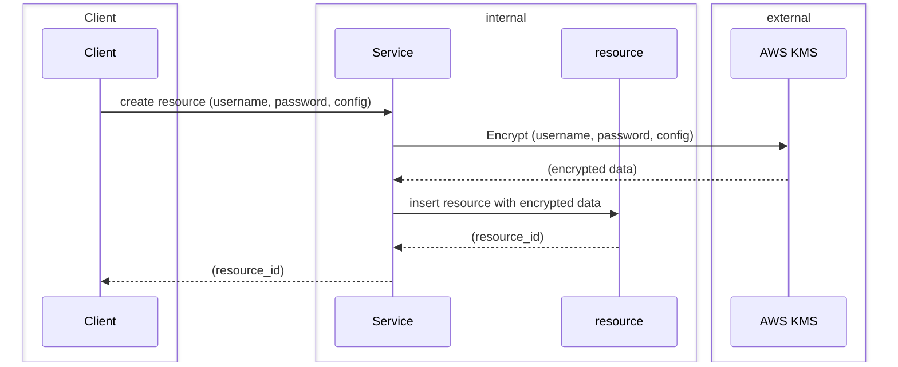

```mermaid
sequenceDiagram
    box Client
    participant C as Client
    end
    box internal
    participant S as Service
    participant R as resource
    end
    box external
    participant K as AWS KMS
    end
    C ->> S: create resource (username, password, config)
    S ->> K: Encrypt (username, password, config)
    K -->> S: (encrypted data)
    S ->> R: insert resource with encrypted data
    R -->> S: (resource_id)
    S -->> C: (resource_id)
```

