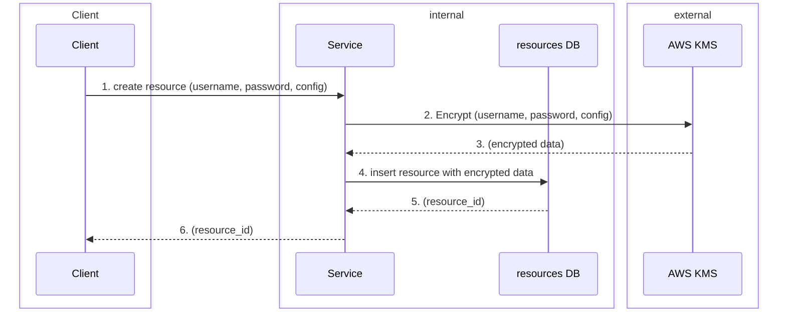
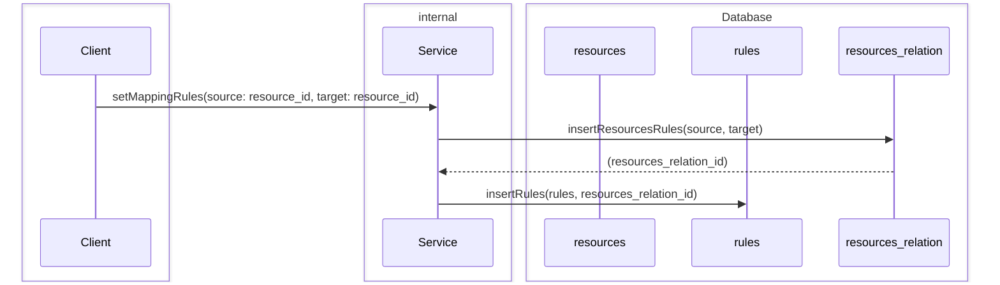
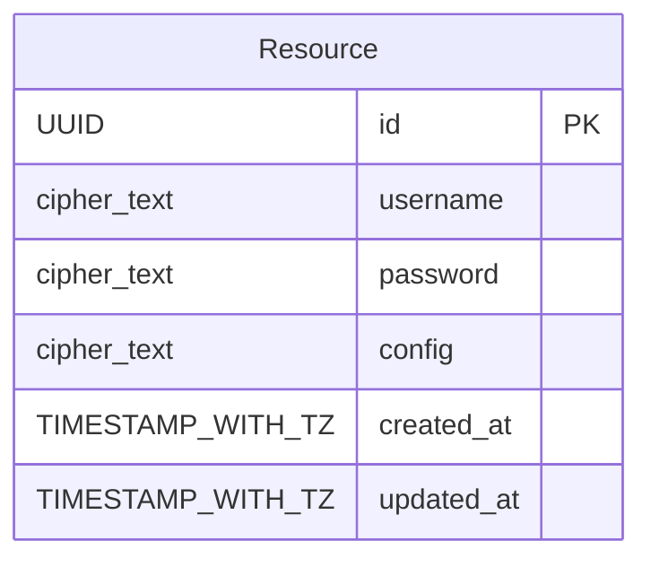

# overall workflows

This documents provide comprehensive workflows in rep-pro, it act like the single source of truth as long as we not found something better

## Create resource

### On step 1 we can insert one more step to either validate username, password, config to check whether this user has enough permissions or required admin roles to use this user generate enough role permissions

 
 
 
 

## Set Mapping rules

 
 

### ER diagram

