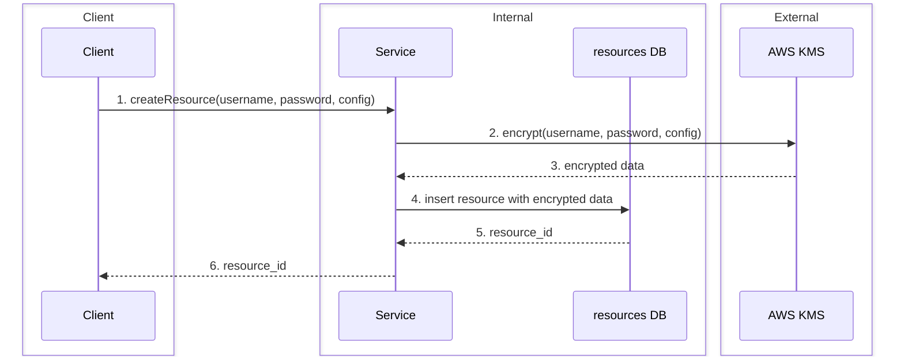
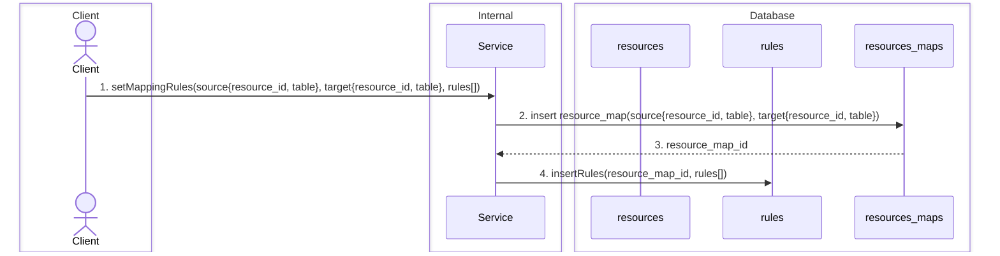
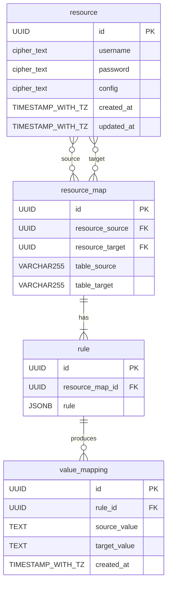

# Overall Workflows

This document provides the comprehensive workflows in `rep-pro` and acts as the single source of truth.

## Table of contents

- [Project scope](#project-scope)
- [Create resource](#create-resource)
- [Set mapping rules](#set-mapping-rules)
- [ER diagram](#er-diagram)

## Project scope

`rep-pro` is a **client-driven data sanitization** service. It lets a client move data from a source to a target while applying sanitization logic that the client configures itself, rather than logic hard-coded into the service.

The client configures three things:

- **Source** — a registered resource and the table to read from.
- **Target** — a registered resource and the table to write the sanitized data into.
- **Rules** — a list of mapping rules that describe, per column, how a source column maps to a target column and the sanitization logic to apply during the copy (e.g. masking, hashing, redaction, format transforms).

Given that configuration, the service is responsible for:

1. Securely storing the source/target connection details (encrypted via AWS KMS).
2. Persisting the source ↔ target mapping and its rules.
3. Executing the configured rules to produce sanitized data in the target.
4. Guaranteeing **consistent mapping** of sanitized values across runs (see below).

### Consistent mapping

For any given source value, the sanitized target value must be **stable across every sanitization run**. For example, if the source contains the name `John` and it is first sanitized to `Foo`, then every future run — for the same rule, on the same column — must also produce `Foo` for `John`. The same source value never produces two different target values, and two different source values never collide onto the same target value within a rule.

This guarantee is what keeps the sanitized target usable: joins, foreign keys, deduplication, and longitudinal analytics on the target only stay valid if the source-to-target value mapping is deterministic over time.

Because the sanitization logic itself (e.g. random pseudonymization) is not generally reproducible from the source value alone, the service must **persist the value mappings it has already produced** and look them up before generating a new one. Conceptually:

- On first encounter of a source value under a rule, the service generates a target value via the rule's logic and stores `(rule, source_value) → target_value`.
- On every subsequent encounter, the service returns the previously stored target value instead of generating a new one.

This is reflected in the [ER diagram](#er-diagram) by the `value_mapping` entity.

Out of scope: orchestration/scheduling, business-level data quality checks, and any sanitization logic that is not expressible as a column-level rule.

## Create resource

The client submits credentials and configuration. The service encrypts the sensitive fields via AWS KMS before persisting the resource and returns the generated `resource_id`.

> **Note (step 1):** an additional authorization check can be added before encryption to validate that the caller has the required permissions (or admin role) to register a resource with the supplied credentials.

## Set mapping rules

The client defines how a source table maps to a target table and the rules that govern the mapping. The service first creates the `resource_map` and then attaches the rules to it.

## ER diagram

> **Note:** `value_mapping` should enforce a uniqueness constraint on `(rule_id, source_value)` so that the consistent mapping guarantee holds at the storage layer (one source value per rule maps to exactly one target value).
